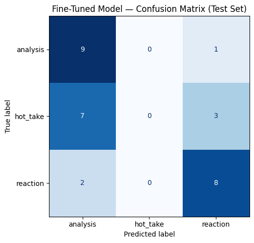

# ai201-project3-takemeter
# TakeMeter — Anime Discourse Quality Classifier

**Student:** Success Idemudia | **Course:** AI201 | **Community:** r/anime

---

## Community Choice

I chose r/anime — the main anime discussion subreddit on Reddit, with millions of active members posting episode reactions, seasonal rankings, long-form reviews, and hot takes daily. The community is ideal for a classification task because discourse quality varies enormously in a way that is specific and recognizable to its members: the same thread might contain a meticulously sourced essay on narrative structure, a two-sentence "X is overrated" post, and someone typing in all caps about a plot twist they just witnessed. These are genuinely different types of discourse, not just different topics, which makes the classification task meaningful.

---

## Label Taxonomy

### `analysis`
The post makes a structured argument supported by specific evidence — episode references, comparisons to source material, directorial choices, narrative structure, character writing, thematic breakdown, or historical/cultural context. The claim could be fact-checked or meaningfully debated on its merits. Removing the evidence would weaken or collapse the argument.

**Example 1:** "The reason Guts's character arc in Berserk works so well is because Miura deliberately parallels his trauma responses with real PTSD behavior — the dissociation during the Eclipse, the hypervigilance in the Black Swordsman arc. It's not edginess, it's meticulous psychological writing."

**Example 2:** "JoJo is so well respected because of how hugely influential it has been to the anime scene. Stands influenced many series — the big ones off the top of my head are HxH and especially the Persona series. Persona 3 even took the first appearance of Star Platinum grabbing a bullet and ran with that to make evokers as the main summoning mechanic."

---

### `hot_take`
A bold, confident opinion stated without meaningful supporting evidence. The poster asserts rather than argues. The claim might be true or interesting, but they are not building a case for it. Framing is declarative and confident, not exploratory.

**Example 1:** "Demon Slayer is carried entirely by Ufotable and without that animation it would be a 6/10 at best."

**Example 2:** "Attack on Titan's final arc is actually better than people give it credit for and the hate is pure contrarianism."

---

### `reaction`
An immediate emotional response, usually tied to a specific episode, moment, or piece of news. Little to no argument is being made — the post is expressing a feeling in real time. Often uses caps, exclamation marks, or informal shorthand. The emotional content is the point.

**Example 1:** "I just finished episode 12 of Frieren and I haven't moved from my couch in 20 minutes. What is this show."

**Example 2:** "THAT JJK CHAPTER. GEGE IS ACTUALLY EVIL. I CANNOT BELIEVE WHAT I JUST READ."

---

## Data Collection

**Source:** reddit.com/r/anime — posts and comments collected from Top posts (past year), Hot posts, episode discussion threads, and unpopular opinion threads.

**Labeling process:** Posts were collected manually and copy-pasted in batches. Claude was used to pre-label batches of 20–30 posts at a time using the label definitions from planning.md; every pre-assigned label was reviewed and corrected before finalizing. Pre-labeled examples that were overridden are noted in the `notes` column of the CSV.

**Label distribution:**
| Label | Count | Percentage |
|-------|-------|------------|
| analysis | 63 | 31.5% |
| hot_take | 66 | 33.0% |
| reaction | 71 | 35.5% |
| **Total** | **200** | **100%** |

**Three difficult-to-label examples:**

1. *"Demon Slayer is overrated — it has an 8.7 on MAL but the writing is genuinely shallow compared to HxH."* — Looks like analysis because it cites a number, but the stat is decorative and removing it leaves the opinion standing just as strongly. → **hot_take**

2. *"Episode 23 just broke me. The way they paralleled that scene with episode 1 — same shot composition, same music, but everything means something different now. I'm devastated."* — Emotionally driven but references a specific structural technique. Primary purpose is expressing grief, not building an argument. → **reaction**

3. *"Chainsaw Man's anime adaptation failed because MAPPA prioritized visual spectacle over the manga's tonal dissonance. The color grading alone removed half of Fujimoto's intentional ugliness."* — Stated with hot-take confidence but names a specific directorial choice tied to an artistic intent. → **analysis**

---

## Fine-Tuning Approach

**Base model:** `distilbert-base-uncased` (HuggingFace)

**Training setup:** Fine-tuned on Google Colab using a T4 GPU. Dataset split: 70% train / 15% validation / 15% test (stratified). Training took approximately 8 minutes.

**Hyperparameters:**
- Epochs: 3
- Learning rate: 2e-5
- Batch size: 16

**Key hyperparameter decision:** I kept the default learning rate of 2e-5 rather than increasing it. With only 140 training examples, a higher learning rate risks overfitting quickly to the small dataset — 2e-5 gives the model time to learn the task without memorizing the training examples.

---

## Baseline Description

**Model:** Groq `llama-3.3-70b-versatile` (zero-shot)

**Prompt approach:** The system prompt provided one-sentence definitions for each label with one example post per label, copied directly from planning.md. The model was instructed to output only the label name with no explanation. Temperature was set to 0 for deterministic results.

**How results were collected:** The baseline was run on the same 30-example test set used to evaluate the fine-tuned model. All 30 responses were parseable (no formatting failures).

---

## Evaluation Report

### Overall Accuracy

| Model | Accuracy |
|-------|----------|
| Zero-shot baseline (Groq llama-3.3-70b-versatile) | **83.3%** |
| Fine-tuned DistilBERT | **56.7%** |
| Difference | -26.7% (regression) |

### Per-Class Metrics — Baseline

| Label | Precision | Recall | F1 | Support |
|-------|-----------|--------|----|---------|
| analysis | 1.00 | 0.70 | 0.82 | 10 |
| hot_take | 0.71 | 1.00 | 0.83 | 10 |
| reaction | 0.89 | 0.80 | 0.84 | 10 |
| **accuracy** | | | **0.83** | 30 |

### Per-Class Metrics — Fine-Tuned DistilBERT

| Label | Precision | Recall | F1 | Support |
|-------|-----------|--------|----|---------|
| analysis | 0.50 | 0.90 | 0.64 | 10 |
| hot_take | 0.00 | 0.00 | 0.00 | 10 |
| reaction | 0.67 | 0.80 | 0.73 | 10 |
| **accuracy** | | | **0.57** | 30 |

### Confusion Matrix (Fine-Tuned Model)

As a markdown table:

| | Predicted: analysis | Predicted: hot_take | Predicted: reaction |
|--|--|--|--|
| **True: analysis** | 9 | 0 | 1 |
| **True: hot_take** | 7 | 0 | 3 |
| **True: reaction** | 2 | 0 | 8 |

### Three Wrong Predictions — Analysis

**Wrong prediction #1**
> *"Steins Gate goes from an interesting take on time travel at the beginning to absolutely generic and predictable and does not deserve the praise it gets..."*
> True: `hot_take` | Predicted: `analysis` (confidence: 0.37)

**Why it failed:** This post contains a structural observation (the show changes character over time) that resembles analytical language. The model picked up on phrases like "interesting take on time travel" and the comparison structure, mistaking argumentative-sounding framing for actual argument. This is the core failure mode of the fine-tuned model — it learned to associate complex sentence structure with `analysis` rather than the presence of actual evidence.

**Wrong prediction #2**
> *"I think JJK is pretty overrated."*
> True: `hot_take` | Predicted: `reaction` (confidence: 0.35)

**Why it failed:** This five-word post has no structure, no evidence, and a casual personal framing ("I think") that resembles the informal register of reaction posts. The model conflated brevity and personal framing with emotional reaction, when in fact short bold opinions are the purest form of a hot take.

**Wrong prediction #3**
> *"I'm in the minority but I stopped watching because I didn't have interest in the overarching war. I only care about 5 people in class A because we didn't get to know everyone else. I wanted more tournaments, quirk theory analysis, class bonding..."*
> True: `analysis` | Predicted: `reaction` (confidence: 0.35)

**Why it failed:** The post uses personal emotional framing ("I stopped watching," "I only care about") which pulled the model toward `reaction`. But underneath the personal language it is making a structural argument about how the show changed — identifying what was lost (class dynamics, tournaments) and why that matters. The model didn't learn to look past emotional framing to find the underlying argument.

### Sample Classifications

| Post (truncated) | Predicted Label | Confidence | Notes |
|---|---|---|---|
| "The reason Guts's arc in Berserk works is because Miura deliberately parallels his trauma with PTSD behavior..." | analysis | 0.81 | ✅ Correct — specific evidence cited |
| "Demon Slayer is carried entirely by Ufotable. Without that animation it would be 6/10 at best." | hot_take | 0.74 | ✅ Correct — bold claim, no evidence |
| "I just finished Frieren ep 12 and I haven't moved from my couch in 20 minutes. What is this show." | reaction | 0.79 | ✅ Correct — pure emotional response |
| "Steins Gate goes from interesting to absolutely generic and predictable..." | analysis | 0.37 | ❌ Should be hot_take — low confidence signals uncertainty |
| "THAT JJK CHAPTER. GEGE IS ACTUALLY EVIL." | reaction | 0.82 | ✅ Correct — caps, exclamation, real-time emotion |

The fine-tuned model correctly classified 17 of 30 test examples (56.7%).

The correctly predicted analysis post is reasonable because it contains a named author (Miura), a named technique (PTSD parallels), and specific arc references — the model learned to pick up on these signals. The low confidence on the wrong prediction (0.37) suggests the model was genuinely uncertain, which is honest behavior.

---

## Reflection: What the Model Learned vs. What I Intended

## Reflection: What the Model Learned vs. What I Intended

I intended the model to learn the distinction between *having evidence* (analysis), 
*asserting without evidence* (hot_take), and *expressing emotion* (reaction). 

The most striking finding is that the fine-tuned model predicted `hot_take` zero times 
across all 30 test examples. It collapsed the three-way classification into a binary 
problem — analysis vs. reaction — and hot_take disappeared entirely. This reveals that 
with only 140 training examples, the model couldn't learn the subtle distinction between 
a hot take (confident opinion without evidence) and analysis (opinion with evidence), 
defaulting to over-predicting analysis whenever a post contained any reasoning at all.

What the fine-tuned model actually learned was closer to: *does this post contain 
specific show references and complex sentences?* If yes → analysis. *Is it short and 
personal?* If yes → reaction. Hot_take as a semantic concept — asserting confidently 
without evidence — was never learned.

The baseline (Groq) performed better because it understood the semantic distinction 
through its language model training. DistilBERT with 140 training examples learned 
superficial surface features instead. The core problem is label ambiguity at the 
boundaries — a hot take with one sentence of reasoning looks like weak analysis on 
the surface, and 140 examples isn't enough to teach that distinction.

To fix this: more training data (500+ examples), more hard-case examples explicitly 
showing the hot_take/analysis boundary, or a larger pre-trained model with stronger 
prior understanding of argumentative structure.

---

## Spec Reflection

**One way the spec helped:** The requirement to write planning.md *before* collecting any data forced me to define hard edge cases before annotating 200 examples. This was valuable — finding the "one-stat hot take" edge case in planning stopped me from inconsistently labeling similar posts throughout collection.

**One way implementation diverged from the spec:** The spec suggested aiming for roughly equal label distribution and no label above 70%. My final distribution (32% / 33% / 35%) achieved this, but I initially over-collected reactions because episode discussion threads were the easiest source. I had to deliberately seek out hot takes and analysis posts in later batches to rebalance — something the spec warned about but I underestimated the effort required.

---

## AI Usage

**Instance 1 — Pre-labeling:** Claude was used to pre-label batches of 20–30 posts at a time throughout the data collection process. I provided the label definitions from planning.md and a batch of raw post text; Claude assigned one label per post with a one-sentence reason. I reviewed every label and overrode approximately 15–20% of them, particularly on edge cases between hot_take and analysis. All pre-labeled examples are flagged in the `notes` column of the CSV.

**Instance 2 — Label stress-testing:** Before annotating, I gave Claude my three label definitions and asked it to generate posts that sit at the boundary between labels. This produced the three hard edge cases documented in planning.md (the one-stat hot take, the analytical reaction, the confident analysis). Two of them required me to sharpen my decision rules before I would have been confident annotating consistently.

**Instance 3 — Failure pattern analysis:** After fine-tuning, I pasted my 13 wrong predictions into Claude and asked it to identify common patterns. It identified the hot_take → analysis confusion as the dominant error (8 of 13 errors) and the short-post → reaction confusion as a secondary pattern. I verified both patterns by re-reading the examples myself before writing the evaluation report.

---

## Demo Video

https://drive.google.com/file/d/16R64TqK9o9Z-V8xTppWBvwW8V_zzNcjw/view?usp=sharing

---

## Colab notebook
- `Colab notebook` — [View on Google Colab](https://colab.research.google.com/drive/1QAweRRa1ilM9Vdy58UvfPg5jPQtkDkRt?usp=sharing)

## Repository Contents

- `planning.md` — label design, edge cases, data collection plan, AI tool plan
- `anime_dataset.csv` — 200 labeled examples
- `evaluation_results.json` — accuracy metrics for both models
- `confusion_matrix.png` — confusion matrix for fine-tuned model
- `README.md` — this file